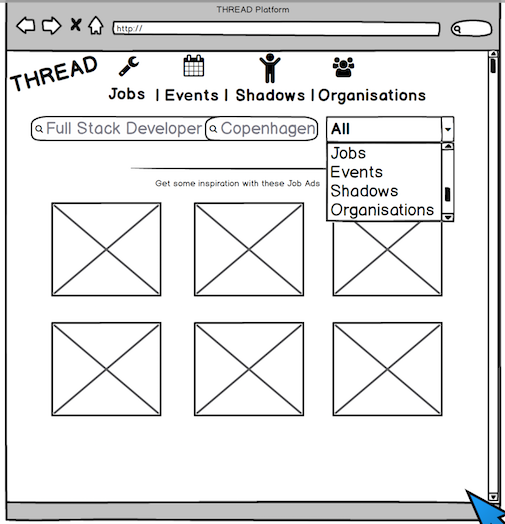
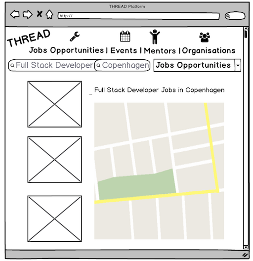
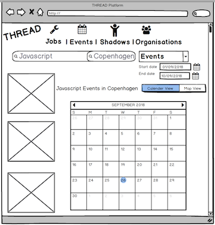
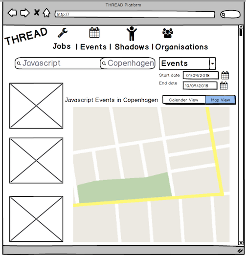

# CLASS05 - FINAL PROJECT

Main repository for the final project for Class 05

## Working Agreement

[WorkingAgreement.md](./WorkingAgreement.md)

_“Working agreements are guidelines that define how groups want to work together, and what they want in the working environment and from each other to feel safe and free to learn, explore and discover.”_

Read the agreement and live up to it. Your project and team work has to have rules so you develop and communicate in the same way and follow up on each others work! **A finished project is only a sucesss if you did it together and learned together.**

Feel free to review the points and contribute/pull request with new ones.

Note that the project is split into two sub-projects. One for the [client](/client) and one for the [server](server). Further documentation in these folders.

## The Customer - THREAD 

#### THREAD stands for Textile Hub for Refugee Empowerment, Employment & Entrepreneurship Advancement in Denmark

THREAD is a dynamic and innovative collaboration of diverse partners from business, design, education, research and refugee support agencies aiming to achieve life-changing results for women who are forging new lives in Denmark.

Learn more about our customer here: https://ctr.hum.ku.dk/research-programmes-and-projects/thread/

## The Project Description

### The goal for this project is to develop an online platform to facilitate the connections between refugee women and individuals or organisations which share an interest in textiles and craft activity.

Due to the complexity of this project we will only develop a platform where Jobs, Events, Calander, Organisations and Indiviuals, which will be called Shadows for now on, will be available to be searched upon, listed and also inserted in the system. The goal is to built the List Views and Insert Views related to these objects and make is possible to search by text and visualize them in a Map.

## Work stories

### First iteration

##### 1A: When I want to find a specific Job Ad I want to be able to search for the title and location at the same time;
##### 1B: When I want to find a specific Event I want to be able to search for the title and location and date range at the same time;
##### 1C: When I want to find a specific Mentor I want to be able to search for the title and location at the same time;
##### 1D: When I want to find a specific Organisation I want to be able to search for the name and location at the same time;


###### Build an UI using the mockup below as a guideline for:

      > A Search View which will also be the Home Page View - use storybook and build the 
      components for the view. 



      > A Search by text Result View - use storybook and build the components for the view. 
      Note: Start date and end date pickers should be available if Event is selected.



      > A Result View with 2 different sub Views, one with results on the Map and another with 
      results on a calendar - use storybook and build the components for the view. 






###### Please check the JSON file for Job ads provided by the API in

https://my.api.mockaroo.com/job_ads.json?key=d38d0f10


## Class Daily Agenda

```
12:00 - 13:30 - Home work review and feature freeze for the previous sprint;
13:30 - 14:00 - Presentation of the next sprint;
14:00 - 14:30 - Lunch;
14:30 - 16:00 - Start of the next sprint.
```

## Process

We suggest the following process for working on the project:

1. Understand the product. Why is it necessary? What does it do and how does it do it?
2. Decide on what your architecture will look like. This is mostly given, since all classes have been focusing on a single type of architecture, but make sure you understand what you are building and why you are building it.
3. Get a simple "hello world" style of prototype running utilizing the entire stack (i.e. have the React application query the API that will return a string of text fetched from the database). Don't try to implement the actual application yet. Make sure that functionality such as connecting to the database is
4. Break the UI into a component hierarchy.
5. Design a data-model for your database that will allow you to store and query the data you need.
6. Build a migration script that will allow you to easily set up any tables you need in your database and fill it with test data.
7. Build a static version of the UI. Don't worry about functionality yet. If you discover discrepancies in your component break-down as you build, update the breakdown.
8. Start thinking about what components should be stateful. Add container components as needed.
9. Start wiring up all of the functionality, fetching the data from the API and implementing real functionality as opposed to having just static components.
10. Plan development so you can stop developing any new features in the last 10-15% of the project (4-6 days). Use this time as a "feature freeze" period, where you focus on "hardening" the product by testing and fixing bugs.

## Working with GIT and handing in iterations

We expect to see running code at a regular frequency, so the product has been broken up into iterations. You are expected to finish approximately one iteration per week. We expect to see each iteration as a _pull request_ on github so we can give you feedback directly in code.

To hand in and get feedback on your iterations you must follow this process for working with git and github:

- _One_ member in each group must make a fork of the [original repository](https://github.com/HackYourFuture-CPH). A fork means that you are making a copy of the repository on your own github profile.
- The member who has made that fork must go to settings and add his team members and the mentors as collaborators
- Whenever you start working on an iteration make a new branch from the master branch and name it accordingly (ì.e. `iteration-1`)
- It is recommended that each team member make a branch off of the `iteration-1` branch and name it based on the work he or she is going to be doing (i.e. `work-story-1a-api-endpoints` if you are going to be working on API endpoints for the work story 1A)
- When you have managed to make the new code work on your local computer, commit your work to your personal branch and push it to github.
- In the github interface find your personal branch and make a pull request towards the `iteration-1` branch. Share the link with your team member(s) and ask for feedback.
- All team members should read through pull requests from other members and do as much as they can in terms of asking questions and researching in order to understand what other members have done. The team members should perform a review and either approve or request changes to the code before it can be merged.
- Once the other team members have reviewed the pull request, go to the github interface and merge the pull request.
- Once you have an iteration ready and need feedback from the mentors, make sure all work is merged to the `iteration-1` branch and then create a pull request towards the `master` branch. Post the pull request link in the main Slack channel.

To get feedback before a sunday session, pull requests must be created saturday at 12:00(midday) the latest.

If you are worried that only one member will have the project on his or her github, there is no need. People can see any contributions you make to open source repositories whether it is on your profile or not. After the project is finished we recommend that the remaining team members fork the finished repository from their teammate, to make it easier to showcase the project on their account.
